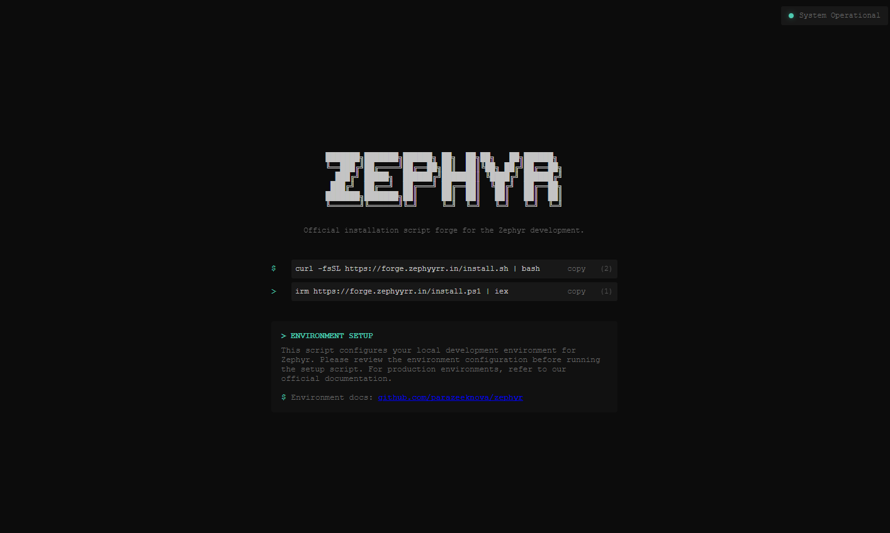

<div align="center">
  <a href="https://forge.zephyyrr.in">
    
  </a>

  <br>
  <a href="#about-"><kbd> <br> About <br> </kbd></a>&ensp;&ensp;
  <a href="#getting-started-"><kbd> <br> Getting Started <br> </kbd></a>&ensp;&ensp;
  <a href="https://github.com/parazeeknova/zephyr"><kbd> <br> Zephyr <br> </kbd></a>&ensp;&ensp;
  <a href="#documentation-"><kbd> <br> Troubleshoot <br> </kbd></a>&ensp;&ensp;
  <a href="https://github.com/parazeeknova/zephyr/blob/main/.github/CONTRIBUTING.md"><kbd> <br> Contribution <br> </kbd></a>
</div>

<br>

<div align="center">

  <a href="https://forge.zephyyrr.in">
    
  </a>

  ###### *<div align="center"><sub>Forge Homepage</sub></div>*

</div>

## About 🚀
Zephyr Forge is a powerful utility designed to streamline the setup process for **[Zephyr development](https://github.com/parazeeknova/zephyr)** environments. It automates the entire configuration process, handling everything from dependency checks to Docker container management, allowing contributors to focus on development rather than environment setup.

## Getting Started 🌱

<div align="center">

###### *<div align="center"><sub>Linux & MacOS</sub></div>*

```bash
curl -fsSL https://forge.zephyyrr.in/install.sh | bash
```

###### *<div align="center"><sub>Windows</sub></div>*

```powershell
irm https://forge.zephyyrr.in/install.ps1 | iex
```

</div>

## Troubleshoot 🛠 

️


<br>
<br>
<div align="center">
  
</div>

##### *<div align="left"><sub>// Copyright © 2025 Parazeeknova</sub></div>*
